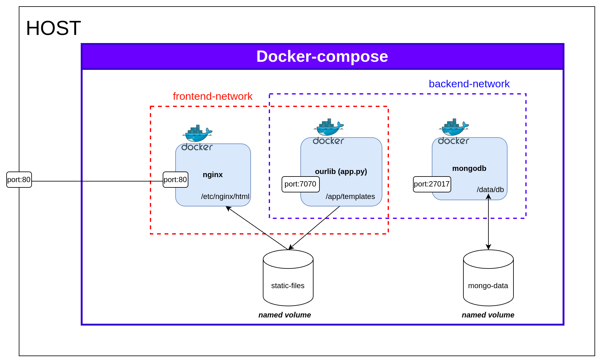

# LetsReview
Lets review is a simple Flask application with a few API requests to do CRUD operations with MongoDB

# Repository Files
`NGIX`- Folder containing a `Dockerfile` to create an NGINX image with `./conf/default.conf` as the NGINX config, used in docker-compose for unit test in the Jenkins pipeline 
`templates/index.html` - a simple HTML page to act as the frontend of the application 
`.env` - environment variables for the app (`app.py`) 
`.env.groovy` - environment variables for the Jenkins pipeline (`Jenkinsfile`) 
`docker-compose.yaml` - used to create a 3 tier architecture of the app to be used for local tests 
  - Frontend - NGIX serving static files and acting as a proxy 
  - Backend - image of app.py created with the root `dockerfile` 
  - Database - MongoDB image
    
`dockerfile` - Create an image of the application 
`e2e_test.sh` - simple E2E script that Jenkins runs during the pipleines to check all the requests are working 
`Jenkinsfile` - the Jenkins pipeline 
`other_Dockerfile` - dockerfile from an older project to show a dockerfile with build stages 
`requirements.txt` - requirements for app.py to work gets installed during image build with `dockerfile` 

# API Requests / Usage
GET /health  
GET /movies 
POST /movies 
GET /movies/<movie_id> 
PUT /movies/<movie_id> 
DELETE /movies/<movie_id> 

It's a simple HTML page with a big text box and a small text box
1) Write a title in the small box
2) Click ADD MOVIE
3) Click Get All Movies
4) Copy the ID into the small box
5) Write a review and click add
6) Put ID in the small box and click reviews to see all the reviews
7) Put ID in the small box and click delete to delete the movie

# Docker Compose 3 Tier Architecture

We see here how docker compose deploys the application

nginx - the nginx container that gets created using `NGINX/dockerfile` sitting on the frontend-network with port 80 mapped to the host's port 80, also has a named volume mounted that has the app's static files, and forwards the reqeusts to the apps port 7070 
ourlib - the app's container with a named volume mounted to where the static files are, has no ports mapped to host, sits on the frontend and backend networks to get requests from the frontend and send them to the backend (to the database) 
mongodb - a mongodb container sitting on the backend network with a namned volume mounted for storing data, gets requests from the app on port 27017 

